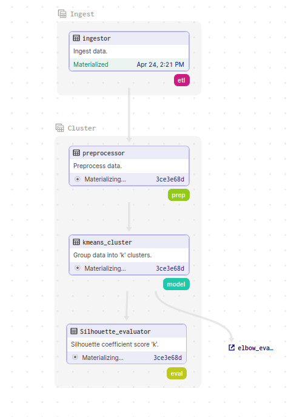

# EDA with Lightning Clustering Pipeline

An example performing `Exploratory Data Analysis` `(EDA)` by implementing simple K-Means clustering algorithm on a Lightning flash dataset collected from NOAA's GLM.
Uses [Dagster Software-Defined Assets](https://docs.dagster.io/concepts/assets/software-defined-assets) to orchestrate a Machine Learning pipeline.

Blog post: [Exploratory Data Analysis with Lightning Clustering Pipeline](https://medium.com/@adebayoadejare/exploratory-data-analysis-with-lightning-clustering-pipeline-6a2bca17d0d3)

<figure align="center">

<figcaption align="center">Lightning clustering map</figcaption>
</figure>

## Installation

First make sure, you have the requirements installed, this can be installed from the project directory via pip's setup command:

`pip install .`

## Quick Start

Run the command to start the dagster orchestration framework: 

`dagster dev # Start dagster daemon and dagit ui`

The dagster daemon is required to start the scheduling, from the dagit ui, you can run and monitor the data assets.

## Data Pipeline

|
|:--:|
|Materializing Lightning clustering pipeline|

### Data Ingestion

Ingests the data needed based on specified time window: start and end dates.

#### Data Assets

+ `ingestor`: Composed of `extract`, `transform`, and `load` data assets.
+ `extract`: downloads [NOAA GOES-R GLM](https://www.goes-r.gov/spacesegment/glm.html) netCDF files from AWS s3 bucket
+ `transform`: converts GLM netCDF into time and geo series CSVs 
+ `load`: loads CSVs to a local backend, persistant duckdb

### Cluster Analysis

Performs grouping of the ingested data by implementing K-Means clustering algorithm.

|
|:--:|
|Visual of clustering process|

#### Data Assets

+ `preprocessor`: prepares the data for cluster model, clean and normalize the data.
+ `kmeans_cluster`: fits the data to an implementation of k-means cluster algorithm.
+ `silhouette_evaluator`: evaluates the choice of 'k' clusters by calculating the silhouette coefficient for each k in defined range.
+ `elbow_evaluator`: evaluates the choice of 'k' clusters by calculating the sum of the squared distance for each k in defined range.

<figure align="center">

<figcaption>Displaying Clusering analysis data assets</figcaption>
</figure>

## Testing

Use the following command to run tests:

`pytest`

## License

[Apache 2.0 License](LICENSE)